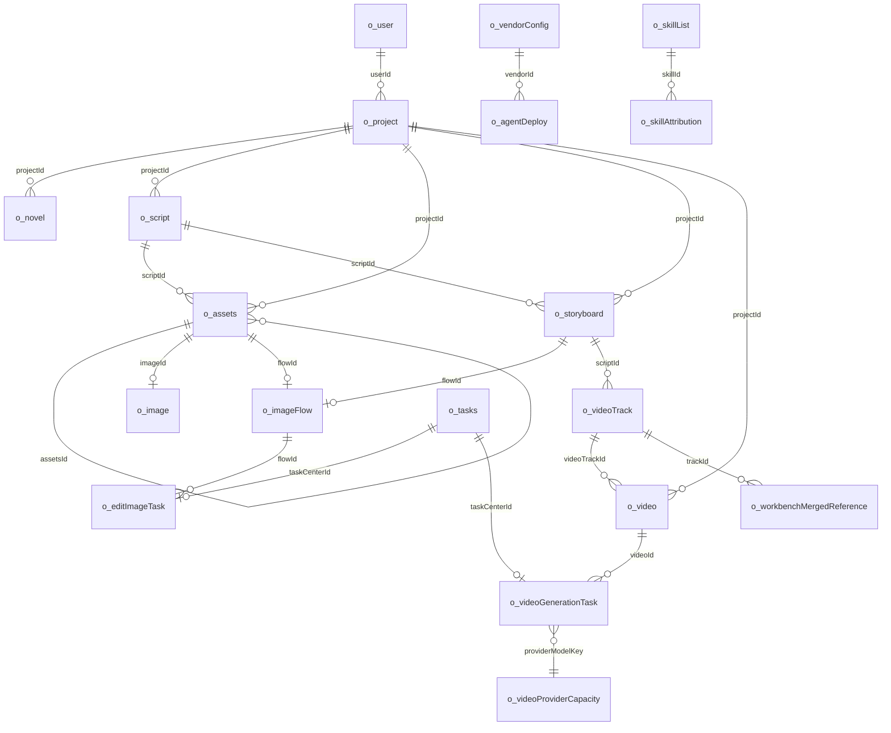

# Toonflow 数据库表设计说明

本文档按当前后端代码中的 SQLite 结构整理，主要来源为 `src/lib/initDB.ts`、`src/lib/fixDB.ts`、`src/types/database.d.ts`。字段类型以 Knex/SQLite 逻辑类型描述；多数业务关系由代码约定维护，只有少量字段在建表时声明了外键。

## 总览

| 模块 | 表 |
| --- | --- |
| 用户与项目 | `o_user`, `o_project`, `o_artStyle` |
| 小说与剧本 | `o_novel`, `o_event`, `o_eventChapter`, `o_script` |
| 资产与图片 | `o_assets`, `o_image`, `o_assets2Storyboard`, `o_scriptAssets`, `o_assetsRole2Audio` |
| 生产分镜与视频 | `o_storyboard`, `o_video`, `o_videoTrack`, `o_workbenchMergedReference`, `o_imageFlow`, `o_editImageTask`, `o_videoGenerationTask`, `o_videoProviderCapacity` |
| AI 与供应商 | `o_vendorConfig`, `o_agentDeploy`, `o_prompt`, `o_modelPrompt`, `o_tasks` |
| 技能与记忆 | `o_skillList`, `o_skillAttribution`, `memories`, `o_agentWorkData` |
| 系统设置 | `o_setting` |

## 核心关系

## 状态约定

| 场景 | 主要字段 | 常见值 |
| --- | --- | --- |
| 图片/分镜生成 | `o_image.state`, `o_storyboard.state` | `未生成`, `生成中`, `已完成`, `生成失败` |
| 视频生成 | `o_video.state` | `生成中`, `生成成功`, `生成失败` |
| 通用任务中心 | `o_tasks.state` | `进行中`, `已完成`, `生成失败` |
| 图片画布任务 | `o_editImageTask.status/state` | `pending/未生成`, `processing/生成中`, `completed/已完成`, `failed/生成失败` |
| 视频队列任务 | `o_videoGenerationTask.status/state` | `queued/排队中`, `submitting/提交中`, `confirming/提交中`, `processing/生成中`, `completed/已完成`, `failed/生成失败` |

业务判断应优先使用英文 `status`；中文 `state` 主要用于旧前端展示兼容。

## 表明细

### `o_user`

用途：本地用户表，目前默认初始化 `admin/admin123`。

| 字段 | 类型 | 说明 |
| --- | --- | --- |
| `id` | integer | 用户 ID，主键 |
| `name` | text | 登录名 |
| `password` | text | 密码明文/旧式本地密码 |

关系：`o_project.userId` 指向该表。

### `o_project`

用途：项目主表，保存项目基础配置、默认模型和画幅。

| 字段 | 类型 | 说明 |
| --- | --- | --- |
| `id` | integer | 项目 ID，主键，常用时间戳生成 |
| `projectType` | string | 项目类型 |
| `imageModel` | string | 默认图片模型，格式通常为 `vendor:modelName` |
| `imageQuality` | string | 默认图片质量，如 `1K/2K/4K` |
| `videoModel` | string | 默认视频模型 |
| `name` | text | 项目名称 |
| `intro` | text | 项目简介 |
| `type` | text | 内容类型 |
| `artStyle` | text | 美术风格 |
| `directorManual` | text | 导演手册/制作说明 |
| `mode` | text | 项目模式 |
| `videoRatio` | text | 视频比例，如 `16:9`, `9:16` |
| `createTime` | integer | 创建时间戳 |
| `userId` | integer | 所属用户 |

关系：被小说、剧本、资产、分镜、视频、任务等表以 `projectId` 引用。

### `o_artStyle`

用途：美术风格素材库。

| 字段 | 类型 | 说明 |
| --- | --- | --- |
| `id` | integer | 风格 ID，主键 |
| `name` | string | 风格名 |
| `fileUrl` | text | 示例图或资源路径 |
| `label` | text | 标签 |
| `prompt` | text | 风格提示词 |

关系：项目可通过 `o_project.artStyle` 保存风格选择。

### `o_novel`

用途：小说原文按章节存储，并记录事件抽取状态。

| 字段 | 类型 | 说明 |
| --- | --- | --- |
| `id` | integer | 章节记录 ID，主键 |
| `chapterIndex` | integer | 章节序号 |
| `reel` | text | 卷/分卷 |
| `chapter` | text | 章节标题 |
| `chapterData` | text | 原文内容 |
| `projectId` | integer | 所属项目 |
| `eventState` | integer | 事件抽取状态，旧逻辑常用 `0` 进行中、`-1` 失败 |
| `event` | text | 抽取结果/摘要 |
| `errorReason` | text | 失败原因 |
| `createTime` | integer | 创建时间 |

关系：`o_eventChapter.novelId` 关联章节与事件。

### `o_event`

用途：小说事件表，承接从章节中抽取出的关键事件。

| 字段 | 类型 | 说明 |
| --- | --- | --- |
| `id` | integer | 事件 ID，主键 |
| `name` | string | 事件名 |
| `detail` | string | 事件详情 |
| `createTime` | integer | 创建时间 |

关系：通过 `o_eventChapter.eventId` 与章节建立多对多关系。

### `o_eventChapter`

用途：事件与章节关联表。

| 字段 | 类型 | 说明 |
| --- | --- | --- |
| `id` | integer | 关联记录 ID，主键 |
| `eventId` | integer | 事件 ID，建表声明引用 `o_event.id` |
| `novelId` | integer | 章节 ID，建表声明引用 `o_novel.id` |

关系：`o_event` 与 `o_novel` 的关联。

### `o_script`

用途：剧本/分集文本表。

| 字段 | 类型 | 说明 |
| --- | --- | --- |
| `id` | integer | 剧本 ID，主键 |
| `name` | text | 剧本名称 |
| `content` | text | 剧本文本 |
| `projectId` | integer | 所属项目 |
| `extractState` | integer | 剧本抽取/生成状态 |
| `createTime` | integer | 创建时间 |
| `errorReason` | text | 失败原因 |

关系：资产、分镜、视频都通过 `scriptId` 归属到剧本。

### `o_assets`

用途：资产主表，保存角色、场景、道具、音频等资产及衍生资产。父资产和衍生资产共用同一张表。

| 字段 | 类型 | 说明 |
| --- | --- | --- |
| `id` | integer | 资产 ID，主键 |
| `name` | text | 资产名 |
| `prompt` | text | 资产生成提示词 |
| `remark` | text | 备注 |
| `type` | text | 资产类型，如 `role`, `scene`, `tool`, `audio`, `clip` |
| `describe` | text | 资产描述 |
| `scriptId` | integer | 来源剧本 |
| `imageId` | integer | 当前选中/最终图片，建表声明引用 `o_image.id` |
| `assetsId` | integer | 父资产 ID；为空表示基础资产，非空表示衍生资产 |
| `projectId` | integer | 所属项目 |
| `flowId` | integer | 图片画布 ID |
| `startTime` | integer | 生成开始时间 |
| `promptState` | string | 提示词生成状态 |
| `audioBindState` | integer | 音色绑定状态 |
| `promptErrorReason` | text | 提示词生成失败原因 |

关系：`assetsId` 自引用形成基础资产 -> 衍生资产；`imageId` 指向 `o_image`；`flowId` 指向 `o_imageFlow`。注意：真实表没有 `state` 字段，衍生资产图片状态以 `o_image.state` 为准。

### `o_image`

用途：资产图片和图片生成结果表。

| 字段 | 类型 | 说明 |
| --- | --- | --- |
| `id` | integer | 图片 ID，主键 |
| `filePath` | text | OSS 相对路径或文件路径 |
| `type` | text | 图片类型/资产类型 |
| `assetsId` | integer | 关联资产 ID |
| `model` | text | 使用模型 |
| `resolution` | text | 清晰度/尺寸 |
| `state` | text | 图片生成状态 |
| `errorReason` | text | 失败原因 |

关系：`o_assets.imageId` 指向当前图片；`o_assets.id` 可与 `o_image.assetsId` 反查历史图片。

### `o_storyboard`

用途：分镜表，保存分镜画面、提示词、图片、视频描述和轨道信息。

| 字段 | 类型 | 说明 |
| --- | --- | --- |
| `id` | integer | 分镜 ID，主键 |
| `scriptId` | integer | 所属剧本 |
| `prompt` | text | 分镜图生成提示词 |
| `filePath` | text | 分镜图路径 |
| `duration` | text | 时长 |
| `state` | text | 分镜图状态 |
| `trackId` | integer | 视频轨道 ID |
| `reason` | text | 失败原因 |
| `track` | text | 轨道名/分组 |
| `videoDesc` | text | 视频画面描述 |
| `shouldGenerateImage` | integer | 是否生成分镜图，`0/1` |
| `projectId` | integer | 所属项目 |
| `flowId` | integer | 图片画布 ID |
| `index` | integer | 分镜顺序 |
| `createTime` | integer | 创建时间 |

关系：通过 `o_assets2Storyboard` 与资产多对多；通过 `flowId` 关联图片画布；通过 `trackId` 参与视频轨道。

### `o_assets2Storyboard`

用途：资产与分镜关联表。

| 字段 | 类型 | 说明 |
| --- | --- | --- |
| `storyboardId` | integer | 分镜 ID |
| `assetId` | integer | 资产 ID |

关系：复合主键 `storyboardId + assetId`，表示某个分镜引用了哪些资产。

### `o_scriptAssets`

用途：剧本与资产关联表。

| 字段 | 类型 | 说明 |
| --- | --- | --- |
| `scriptId` | integer | 剧本 ID |
| `assetId` | integer | 资产 ID |

关系：复合主键 `scriptId + assetId`。

### `o_assetsRole2Audio`

用途：角色资产与音频/音色资产绑定表。

| 字段 | 类型 | 说明 |
| --- | --- | --- |
| `assetsRoleId` | integer | 角色资产 ID |
| `assetsAudioId` | integer | 音频资产 ID |

关系：复合主键 `assetsAudioId + assetsRoleId`。

### `o_imageFlow`

用途：图片编辑画布表，保存前端画布节点与连线 JSON。

| 字段 | 类型 | 说明 |
| --- | --- | --- |
| `id` | integer | Flow ID，主键 |
| `flowData` | text | JSON：`{ nodes, edges }` |

关系：`o_assets.flowId`、`o_storyboard.flowId` 指向该表；`o_editImageTask.flowId` 记录任务对应画布。保存已有 flow 时，后端会按 `flowId + nodeId` 合并任务字段，避免旧快照覆盖异步结果。

### `o_editImageTask`

用途：图片画布异步生图任务与历史结果表。

| 字段 | 类型 | 说明 |
| --- | --- | --- |
| `id` | integer | 任务 ID，主键 |
| `projectId` | integer | 项目 ID |
| `scriptId` | integer | 剧本 ID |
| `deriveAssetId` | integer | 旧字段，衍生资产 ID |
| `targetType` | string | 标准目标类型：`deriveAsset` 或 `storyboard` |
| `targetId` | integer | 标准目标 ID |
| `flowId` | integer | 画布 ID |
| `nodeId` | text | 生成节点 ID |
| `references` | text | 引用图列表 JSON |
| `model` | text | 模型 |
| `quality` | text | 清晰度 |
| `ratio` | text | 比例 |
| `prompt` | text | 生图提示词 |
| `status` | string | 英文任务状态 |
| `state` | string | 中文兼容状态 |
| `url` | text | 完成结果图路径 |
| `reason` | text | 失败原因 |
| `taskCenterId` | integer | 任务中心 ID |
| `createTime` | integer | 创建时间 |
| `updateTime` | integer | 更新时间 |

关系：指向 `o_imageFlow` 节点，并可通过 `targetType + targetId` 查询目标历史结果。完成后会同步更新 flow 节点的 `generatedImage/historyId/selectedResult`。

### `o_video`

用途：视频生成结果表。

| 字段 | 类型 | 说明 |
| --- | --- | --- |
| `id` | integer | 视频 ID，主键 |
| `filePath` | text | 视频保存路径 |
| `errorReason` | text | 失败原因 |
| `time` | integer | 创建/提交时间 |
| `state` | text | 视频状态：`生成中`, `生成成功`, `生成失败` |
| `scriptId` | integer | 剧本 ID |
| `projectId` | integer | 项目 ID |
| `videoTrackId` | integer | 轨道 ID |

关系：`o_videoGenerationTask.videoId` 记录异步任务；`o_videoTrack.selectVideoId` 可指向用户选中的视频。

### `o_videoGenerationTask`

用途：通用视频异步生成队列表，当前 Dreamina 使用长周期异步提交和轮询，其他供应商先通过同一队列包装旧同步生成逻辑。

| 字段 | 类型 | 说明 |
| --- | --- | --- |
| `id` | integer | 队列任务 ID，主键 |
| `videoId` | integer | 关联 `o_video.id` |
| `projectId` | integer | 项目 ID |
| `scriptId` | integer | 剧本 ID |
| `model` | text | 模型完整键，通常 `vendor:modelName` |
| `vendorId` | string | 供应商 ID |
| `providerModelKey` | string | 供应商模型槽位键，同版本跨 CLI 子命令共享 |
| `taskCenterId` | integer | 任务中心记录 ID |
| `requestJson` | text | 任务输入 JSON，包含 `videoPath/input/relatedObjects` |
| `submitId` | string | 官方异步任务 ID，Dreamina 为 `submit_id` |
| `officialTaskId` | string | 官方确认后的任务 ID |
| `historyRecordId` | string | 官方历史记录 ID |
| `providerAccountId` | string | 提交时供应商账号 ID |
| `remoteConfirmedAt` | integer | 官方任务确认时间 |
| `phase` | string | 细分阶段，包含 `capacity_wait` |
| `status` | string | 英文状态 |
| `state` | string | 中文状态 |
| `errorReason` | text | 失败原因 |
| `rawOutput` | text | 供应商/CLI 原始输出，便于排查 |
| `nextPollTime` | integer | 下次轮询时间戳 |
| `nextSubmitTime` | integer | 下次允许提交/容量探测时间 |
| `pollCount` | integer | 已轮询次数 |
| `submitAttemptCount` | integer | 提交尝试次数 |
| `capacityWaitStartedAt` | integer | 首次进入容量等待的时间 |
| `confirmStartedAt` | integer | 开始确认官方任务的时间 |
| `lastProviderCode` | string | 最近供应商返回码 |
| `providerQueueStatus` | integer | 官方 `queue_status` |
| `providerQueueIndex` | integer | 官方 `queue_idx` |
| `providerQueueLength` | integer | 官方 `queue_length` |
| `startTime` | integer | 入队时间 |
| `updateTime` | integer | 更新时间 |
| `finishTime` | integer | 完成/失败时间 |

关系：关联 `o_video`、`o_tasks`。Dreamina 并发按 `providerModelKey` 统计官方已确认的 `processing`；`confirming` 不计入官方活动数，但会暂停同模型的新提交探测。

### `o_videoProviderCapacity`

用途：记录供应商账号下某个模型槽位的容量阻塞状态，避免同模型任务在官方满载时集中提交。

| 字段 | 类型 | 说明 |
| --- | --- | --- |
| `id` | integer | 主键 |
| `vendorId` | string | 供应商 ID |
| `providerAccountId` | string | 供应商账号 ID，未知时为 `default` |
| `providerModelKey` | string | 模型槽位键 |
| `capacityBlocked` | integer | 是否处于容量阻塞 |
| `blockedUntil` | integer | 下次允许队首探测的时间 |
| `lastProviderCode` | string | 最近容量返回码，Dreamina 当前为 `1310` |
| `createTime` | integer | 创建时间 |
| `updateTime` | integer | 更新时间 |

唯一约束：`vendorId + providerAccountId + providerModelKey`。

### `o_videoTrack`

用途：视频轨道/片段组表，管理某个分镜轨道下的视频候选与最终选择。

| 字段 | 类型 | 说明 |
| --- | --- | --- |
| `id` | integer | 轨道 ID，主键 |
| `videoId` | integer | 关联视频 ID，旧字段/当前视频 |
| `projectId` | integer | 项目 ID |
| `scriptId` | integer | 剧本 ID |
| `state` | text | 轨道状态 |
| `reason` | text | 失败原因 |
| `prompt` | text | 视频生成提示词 |
| `selectVideoId` | integer | 用户选中的视频 ID |
| `duration` | integer | 时长 |

关系：`o_video.videoTrackId` 归属到轨道；`selectVideoId` 指向最终使用的视频。

### `o_workbenchMergedReference`

用途：视频工作台持久化合图引用。合图是创建时快照，源资产或分镜后续变化不会覆盖历史文件。

| 字段 | 类型 | 说明 |
| --- | --- | --- |
| `id` | integer | 合图引用 ID，主键 |
| `projectId` | integer | 项目 ID |
| `scriptId` | integer | 剧集 ID |
| `trackId` | integer | 视频轨道 ID |
| `mergeType` | string | `storyboard` 或 `assets` |
| `name` | text | 显示名称 |
| `filePath` | text | OSS 数据目录内的合图路径 |
| `fileType` | string | 当前固定为 `image` |
| `prompt` | text | 可选提示词 |
| `sourceRefs` | text | 按合图顺序保存的源引用 JSON |
| `position` | integer | 合图在轨道引用列表中的插入位置 |
| `state` | string | `active` 或 `archived` |
| `createTime` | integer | 创建时间 |
| `updateTime` | integer | 更新时间 |

关系：属于项目、剧集和 `o_videoTrack`。生成视频时作为单张图片解析，`sourceRefs` 仅用于恢复、审计和排查，不会展开成多个模型输入。

### `o_tasks`

用途：任务中心表，给前端任务中心展示通用任务状态。

| 字段 | 类型 | 说明 |
| --- | --- | --- |
| `id` | integer | 任务中心 ID，主键 |
| `projectId` | integer | 项目 ID |
| `taskClass` | string | 任务类别，如 `编辑生图`, `视频生成` |
| `relatedObjects` | string | 关联对象，字符串或 JSON |
| `model` | string | 使用模型 |
| `describe` | text | 描述/提示词 |
| `state` | string | 中文状态 |
| `episode` | integer | 剧本/集 ID |
| `startTime` | integer | 开始时间 |
| `reason` | text | 失败原因 |

关系：`o_editImageTask.taskCenterId`、`o_videoGenerationTask.taskCenterId` 指向该表。

### `o_vendorConfig`

用途：供应商配置表。

| 字段 | 类型 | 说明 |
| --- | --- | --- |
| `id` | string | 供应商 ID，主键，如 `toonflow`, `dreamina` |
| `inputValues` | text | 输入项 JSON，如 API Key、Base URL |
| `models` | text | 模型配置 JSON，支持 `queueConfig` |
| `enable` | integer | 是否启用，`0/1` |

关系：供应商代码在 `data/vendor/<id>.ts`；模型通过 `vendorId:modelName` 被项目、任务和生成接口引用。

### `o_agentDeploy`

用途：Agent 到模型的绑定配置。

| 字段 | 类型 | 说明 |
| --- | --- | --- |
| `id` | integer | 配置 ID，主键 |
| `model` | string | 模型完整键 |
| `key` | string | Agent key，如 `productionAgent:storyboardGenAgent` |
| `modelName` | string | 模型名 |
| `vendorId` | text | 供应商 ID |
| `desc` | string | 描述 |
| `name` | string | 展示名 |
| `temperature` | integer | 温度参数 |
| `maxOutputTokens` | integer | 最大输出 tokens |
| `disabled` | boolean | 是否禁用 |
| `type` | string | 后续迁移补充字段 |

关系：调用 `u.Ai` 或 Agent 工作流时读取该表选择模型。

### `o_prompt`

用途：系统 Prompt/技能 Prompt 表。

| 字段 | 类型 | 说明 |
| --- | --- | --- |
| `id` | integer | Prompt ID，主键 |
| `name` | string | 名称 |
| `type` | string | 类型，如 `eventExtraction`, `scriptAssetExtraction`, `videoPromptGeneration` |
| `data` | text | Prompt 内容 |
| `useData` | text | 使用侧数据/扩展字段 |

关系：Agent、资产提取、视频提示词生成等流程读取。

### `o_modelPrompt`

用途：模型绑定提示词/模型辅助文件表。

| 字段 | 类型 | 说明 |
| --- | --- | --- |
| `id` | integer | 记录 ID，主键 |
| `vendorId` | string | 供应商 ID |
| `model` | string | 模型名 |
| `fileName` | text | 文件名 |
| `path` | text | 文件路径 |

关系：用于按模型查找特定提示词或辅助文件。

### `o_agentWorkData`

用途：Agent 工作流中间数据/产物表。

| 字段 | 类型 | 说明 |
| --- | --- | --- |
| `id` | integer | 记录 ID，主键 |
| `projectId` | integer | 项目 ID |
| `episodesId` | integer | 剧本/集 ID |
| `key` | string | 索引 key |
| `data` | string | 工作流数据 JSON/文本 |
| `createTime` | integer | 创建时间 |
| `updateTime` | integer | 更新时间 |

关系：用于保存脚本/生产 Agent 分阶段产物。

### `o_setting`

用途：全局键值配置和迁移标记表。

| 字段 | 类型 | 说明 |
| --- | --- | --- |
| `key` | text | 配置键，主键 |
| `value` | text | 配置值 |

常见 key：`tokenKey`, `messagesPerSummary`, `agentUseMode`, `migration:image-flow-contract-v2`。

### `o_skillList`

用途：内置技能与参考文档索引表。

| 字段 | 类型 | 说明 |
| --- | --- | --- |
| `id` | text | 技能 ID，主键 |
| `md5` | text | 文件 MD5 |
| `path` | text | 技能文件路径 |
| `name` | text | 技能名 |
| `description` | text | 技能描述 |
| `embedding` | text | 描述向量 JSON |
| `type` | text | `main` 或 `references` |
| `createTime` | integer | 创建时间 |
| `updateTime` | integer | 更新时间 |
| `state` | integer | 索引状态 |

关系：`o_skillAttribution.skillId` 指向该表。

### `o_skillAttribution`

用途：技能归属/可被哪个 Agent 使用的关联表。

| 字段 | 类型 | 说明 |
| --- | --- | --- |
| `skillId` | text | 技能 ID，建表声明引用 `o_skillList.id` |
| `attribution` | text | 归属 Agent 文件名 |

关系：复合主键 `skillId + attribution`。

### `memories`

用途：Agent 对话记忆与摘要表。

| 字段 | 类型 | 说明 |
| --- | --- | --- |
| `id` | text | 记忆 ID，主键 |
| `isolationKey` | text | 隔离键，用于项目/会话隔离 |
| `type` | text | `message` 或 `summary` |
| `role` | text | `user` 或 `assistant` |
| `name` | text | 名称 |
| `content` | text | 内容 |
| `embedding` | text | 向量 JSON |
| `relatedMessageIds` | text | 摘要关联的消息 ID JSON |
| `summarized` | integer | message 是否已摘要，`0/1` |
| `createTime` | integer | 创建时间 |

关系：用于 Agent 长短期记忆，按 `isolationKey + type/summarized` 建索引。

## 重要设计注意

- `o_assets` 不存图片完成状态，资产卡片应通过 `o_assets.imageId -> o_image.state/filePath` 读取。
- `o_imageFlow.flowData` 是 JSON 文档型数据；节点任务字段由后端合并保护，不能把它当作纯前端快照覆盖。
- `o_editImageTask` 是图片画布任务和历史结果的事实来源；历史结果按 `targetType + targetId` 隔离。
- `o_videoGenerationTask` 是视频异步队列事实来源；前端视频状态展示仍以 `o_video` 为兼容读取入口。
- 多数表没有严格外键约束，删除/迁移时必须由业务代码同步清理关联数据。
