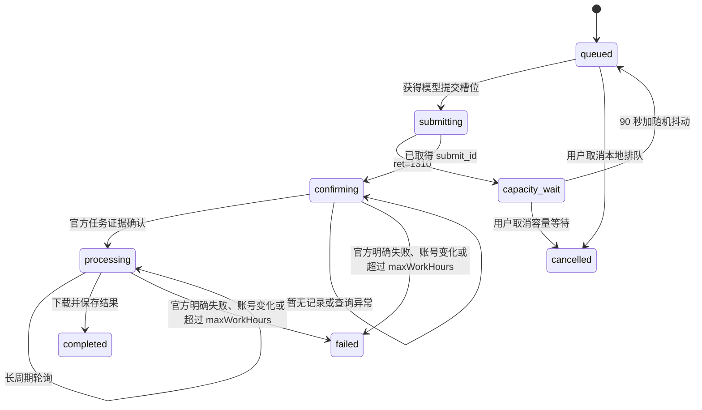

# 视频生成异步任务管理

## 核心目标

视频任务由后端长期管理，前端提交后立即获得 `videoId`。队列按模型控制官方活动任务并发，提交确认和结果轮询互不阻塞。

核心实现：

- `src/utils/videoGenerationQueue.ts`
- `src/utils/dreaminaCli.ts`
- `src/services/workbenchReference.ts`
- `src/lib/migrations/videoQueueV2.ts`
- `src/lib/migrations/videoQueueV3.ts`
- `src/lib/migrations/videoQueueV4.ts`
- `src/routes/production/workbench/generateVideo.ts`
- `src/routes/production/workbench/batchGenerateVideo.ts`

## 状态机



| `status` | `state` | 含义 |
| --- | --- | --- |
| `queued` | `排队中` | 仅在 Toonflow 本地排队 |
| `submitting` | `提交中` | 正在调用供应商提交任务 |
| `confirming` | `提交中` | 已取得 `submit_id`，只查询原任务，禁止重提 |
| `processing` | `生成中` | 官方已确认，计入模型并发 |
| `completed` | `已完成` | 结果已保存到 `o_video.filePath` |
| `failed` | `生成失败` | 明确失败或无法安全确认 |
| `cancelled` | `已取消` | 用户在提交官方前取消本地任务 |

`phase` 进一步区分 `queued / capacity_wait / submitting / confirming / processing / completed / failed / cancelled`。

## 引用文件

新任务的 `requestJson` 只保存数据库引用标识：

```ts
{
  version: 2,
  videoPath: string,
  input: {
    prompt: string,
    mode: unknown,
    duration: number,
    aspectRatio: string,
    resolution: string,
    audio?: boolean
  },
  references: Array<{
    sources: "storyboard" | "assets" | "merged",
    id: number,
    order: number
  }>,
  relatedObjects: object
}
```

执行时重新查询数据库并解析原始文件：

- `storyboard`：`o_storyboard.filePath`
- `assets`：`o_assets.imageId -> o_image.filePath`
- `merged`：`o_workbenchMergedReference.filePath`

队列禁止使用 HTTP URL、`?size=` 或 `smallImage` 路径。图片、视频、音频均把本地原始绝对路径传给 Dreamina CLI，不缩放、不转码。

旧任务缺少来源 ID 时，一次性迁移会把 Data URL 按原 MIME 解码到 `data/temp/video-queue-legacy/<taskId>/`，任务终态后删除。

## Dreamina 提交确认

CLI 使用 `--poll=0`，本地 `submit_id`、`querying`、素材上传成功和退出码都不能单独证明官方任务已创建。

可接受的官方证据：

1. 查询日志中出现匹配 `submit_id` 的 `history_record_id` 和 `task_id`。
2. 同一提交日志出现匹配任务的 `[MCP.Generate] ... ret=0` 与 `[SubmitTask] submit generation task finished`。

取得 `submit_id` 后首次写入 `providerSubmittedAt` 并进入 `confirming`，每 60 秒调用 `query_result` 和 `list_task` 查询原任务。暂时查不到记录、网络错误或 CLI 查询失败均不重提、不立即失败；只有官方明确失败、账号变化或从 `providerSubmittedAt` 起超过 `maxWorkHours` 才失败。到达超时上限时，后端会先做最后一次官方查询。

`ExceedConcurrencyLimit` 或 `ret=1310` 表示本次官方任务未创建。任务进入 `capacity_wait`，90 秒加 0-15 秒随机抖动后仅由该模型队首重新探测，不写失败状态。

任务保存 `submitId / officialTaskId / historyRecordId / providerAccountId / remoteConfirmedAt`。轮询发现登录账号变化时停止任务并给出明确错误。

## 并发与轮询

`queueConfig`：

```ts
{
  maxConcurrent?: number;
  pollInitialDelaySec?: number;
  pollMinIntervalSec?: number;
  pollMaxIntervalSec?: number;
  maxWorkHours?: number;
  maxWaitHours?: number; // 兼容旧配置一版
}
```

Dreamina 默认：

- `maxConcurrent = 1`
- `pollInitialDelaySec = 60`
- `pollMinIntervalSec = 120`
- `pollMaxIntervalSec = 600`
- `maxWorkHours = 6`

Dreamina 槽位按模型版本归并，不按 CLI 子命令区分：

```text
dreamina:seedance2.0
dreamina:seedance2.0fast
dreamina:seedance2.0_vip
dreamina:seedance2.0fast_vip
```

同版本的文生视频、图生视频、多帧视频和多模态视频共享 `providerModelKey`、并发配置与容量阻塞状态。四个模型版本互不阻塞。调度占用槽位为 `submitting + confirming + processing`；只要占用数小于 `maxConcurrent`，调度器就继续串行提交该模型的队首任务。`knownActive` 仍只统计官方已确认的 `processing`。若官方实际容量低于用户配置，后续提交会收到 `ret=1310` 并进入容量等待。

轮询使用固定短间隔，不按等待时长递增：

- 官方 `queue_status=1`：120 秒。
- 官方 `queue_status=2`：60 秒。
- `confirming`：60 秒。
- 容量等待：90 秒加 0-15 秒抖动。
- 网络或 CLI 查询异常：60 秒。

任务完成或失败后立即唤醒同模型队首。本地 `queued/capacity_wait` 可无限等待，不计入 `maxWorkHours`；只有取得官方 `submit_id` 后才开始计算官方工作时长。

多个 Toonflow/Electron 实例共享同一数据目录时，队列使用 SQLite 租约选出唯一调度进程。只有租约持有者可以提交和轮询，其他实例仍可提供 API；租约持有者退出或超过 90 秒未续约后，其它实例自动接管。队列日志中的 `processId` 和 `schedulerOwner` 可用于定位多实例问题。

## 本地取消

```text
POST /production/workbench/cancelVideoGenerationTask
```

请求：

```ts
{ taskId: number }
```

仅允许取消 `status=queued`、无 `submitId` 且 `phase=queued|capacity_wait` 的任务。取消成功后同步更新队列任务、视频和任务中心为 `cancelled/已取消`。已经进入 `submitting/confirming/processing` 的任务返回 HTTP `409`，因为任务可能已提交官方，不能安全取消。

## 结果保存

Dreamina 下载出的本地文件直接复制到 OSS 目标路径；远程 URL 使用流式下载。结果文件不转成 Base64。

`rawOutput` 最多保存末尾 32 KB，完整 Dreamina CLI 日志仍位于官方日志目录。

## 排障日志

队列状态变化会同时输出到启动控制台，并按天写入 Toonflow 数据目录：

```text
logs/video-queue/YYYY-MM-DD.log
```

主要事件包括 `task.enqueued`、`slot.claimed`、`submit.started`、`submit.accepted`、`submit.capacity_wait`、`poll.started`、`poll.updated`、`poll.retry_scheduled`、`result.saved`、`task.completed` 和 `task.failed`。

每条日志携带 `queueTaskId/videoId/providerModelKey/submitId` 等追踪字段，但不记录提示词、登录凭据、媒体内容或完整 CLI 参数。即梦命令层额外在控制台输出命令名、耗时、退出码和 stdout/stderr 字节数；完整 CLI 日志仍由即梦保存在其官方日志目录。

## 重启恢复

- `queued`：继续本地排队，执行时重新解析数据库最新原文件。
- `confirming` 且有 `submit_id`：继续查询原任务，不重新提交。
- 有官方凭据的 `submitting / processing`：恢复为 `processing` 并继续轮询。
- 无 `submit_id` 和官方凭据的中断提交：标记失败，不自动重提。
- 已确认任务绝不重复提交。

## 数据库迁移

迁移键：`migration:video-queue-v2`。

首次执行：

1. 创建 `backups/db2-before-video-queue-v2-<timestamp>.sqlite` 一致性备份。
2. 外置旧排队任务媒体。
3. 清理终态任务中的 Base64 和冗余输出。
4. 释放没有官方凭据的假 `processing`。
5. 执行 `PRAGMA integrity_check` 和 `VACUUM`。
6. 数据库启用 `WAL / synchronous=NORMAL / busy_timeout=5000`。

纠偏迁移键：`migration:video-queue-v2-recover-interrupted-queued`。它只用于从备份恢复被旧重启策略误标失败、且从未获得 `submitId` 的最新本地排队批次。

模型槽位迁移键：`migration:video-queue-v3-provider-slots`。它回填 `providerModelKey`，恢复因 `ret=1310` 被旧逻辑误判失败的任务，并只恢复具有官方任务凭据的旧轮询任务。

官方工作时长迁移键：`migration:video-queue-v4-provider-work-time`。它回填 `providerSubmittedAt`，将旧 `maxWaitHours` 配置转换为 `maxWorkHours`，并恢复因旧排队总时长口径误判失败且已有 `submitId` 的任务。恢复任务只查询原官方任务，绝不重新提交。
