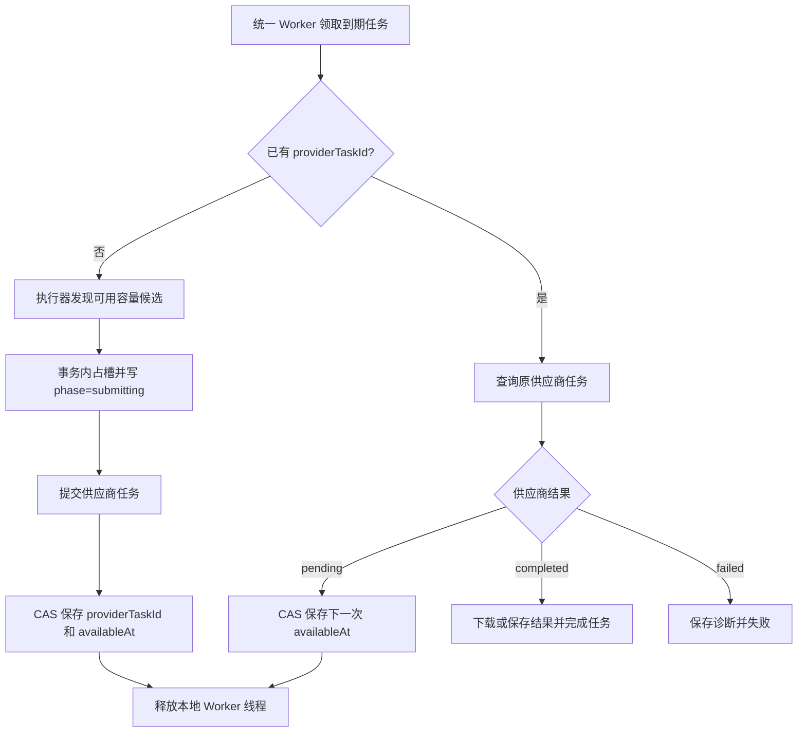

# 视频生成统一 Worker 架构

视频生成不再运行独立调度器。应用和独立 Worker 都只启动 `unifiedTaskWorker`，由 `handler=video-generation` 处理视频任务。

## 数据职责

- `o_tasks`：唯一生命周期状态源，保存 `status / phase / progress / providerTaskId / availableAt / lease / version`。
- `o_videoGenerationTask`：保存视频请求、模型、供应商实例或账号、传输诊断、结果明细，以及供旧接口读取的兼容状态投影。
- `o_videoProviderCapacity`：只保留供应商冷却和阻塞事实，不负责领取或调度任务。

业务代码判断任务是否排队、执行、完成、失败或取消时，必须读取 `o_tasks`。视频明细状态只能用于兼容展示和排障。

## 单步执行

统一 Worker 最多并行执行 4 个视频本地步骤。远端等待不占本地执行线程；真正的供应商并发由 `providerCapacityKey` 控制：

- Zealman：`zealman:<规范化实例 URL>`，每实例容量 1，U06 和 Light2v 共用实例槽。
- Dreamina：规范化供应商模型键及模型 `maxConcurrent`。
- 其他供应商：供应商模型键及已有并发配置。

容量检查、容量绑定和 `o_tasks.phase=submitting` 在同一数据库事务完成。终态通过 `o_tasks.status` 自动退出占用统计。

## 执行器边界

供应商差异位于 `src/services/videoQueue/executors/`：

- `legacy.ts`：包装原有同步 `u.Ai.Video()`。
- `dreamina.ts`：CLI 提交、确认、账号绑定、容量等待和查询。
- `zealman.ts`：实例健康、工作流指纹、实例槽、提交、结果查询、任务丢失与实例不可用复核。

统一处理器只接受 `wait / accepted / pending / completed / failed` 结果，不按供应商 ID 分支。

## 恢复与竞争

- 有 `o_tasks.providerTaskId`：只恢复原任务查询。
- 统一任务缺少远端 ID、但视频明细已有 `submitId`：先将该 ID 恢复到 `o_tasks`，再查询原任务。
- 两处都没有远端 ID：视为尚未完成提交，回到本地队列。
- 所有异步结果通过 `taskId + version + providerTaskId` 比较并交换；取消、失败或新版状态不会被旧查询结果覆盖。

Zealman 的两类复核互相独立：

- `remote_reconcile`：提交满 60 秒后，结果仍 pending、ComfyUI 队列为空且 history 不含原 `prompt_id`；连续两次才失败。
- `remote_unavailable_reconcile`：健康接口明确不可用，或健康与 ComfyUI 状态接口同时不可达；连续两次才失败。

两类失败都保留原实例、`prompt_id` 和诊断，不自动重提。Zealman 没有真实百分比时始终保存 `progress=null`。

## 迁移

幂等迁移键：`migration:video-queue-v6-unified-worker`。

迁移在统一任务 V1 迁移之后执行，为活动视频任务补齐 handler、payload、远端 ID、轮询时间和容量键。未提交任务保持本地排队；已提交任务恢复原任务查询；终态不重新执行。

